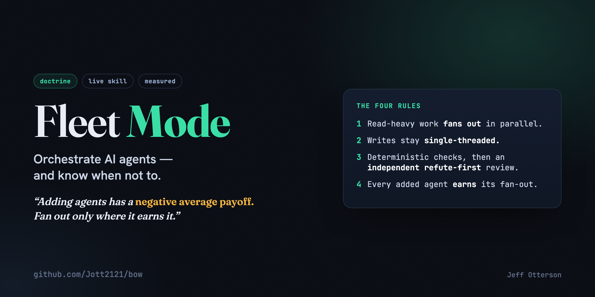

# Fleet Mode

**A measured doctrine for orchestrating AI agents, and knowing when not to.**



Most "multi-agent" advice assumes more agents is better. It usually isn't. Fleet Mode is the
opposite stance, run as a live [Claude Code](https://docs.claude.com/en/docs/claude-code) skill:
**adding agents has a negative average payoff on most tasks, so you fan out only where it
demonstrably earns it, and you keep the writes single-threaded and gated.**

It's the operating mode behind [bow](https://github.com/Jott2121/bow) (an autonomous all-Claude
chief-of-staff agent) and the builds it ships.

> 🧩 One layer of a five-repo [**cost-governance stack**](https://github.com/Jott2121/bow#the-system-a-cost-governance-stack) for operating AI agents cost-efficiently; [bow](https://github.com/Jott2121/bow) is the flagship that runs every layer in production.

---

## The four rules

1. **Read-heavy work fans out.** Research, codebase/PR review, multi-file audits: parallel
   subagents in clean contexts, each returning a condensed summary. This is the *only* thing
   fan-out is for.
2. **Writes stay single-threaded.** One agent makes the edit. Never fan out to edit in parallel.
3. **Deterministic checks first, then an independent refute-first review.** Tests/types/lint/build
   must pass with no model in the loop; then a *separate* clean-context reviewer tries to *refute*
   the work. No agent grades its own work. Fail closed.
4. **Every added agent earns its fan-out.** Default to a single strong agent. More agents add
   intelligence (extra perspectives, verification), not parallel actions.

Plus the two non-negotiables: **human-gate anything irreversible/MAJOR** (push, deploy, send,
real-money trade, mass-delete, new spend), and **log an honest receipt** of every kept/killed
decision with the real number.


## The gate (run in order)

1. **Classify stakes.** trivial: light check, ship. non-trivial: full gate. irreversible: full
   gate plus human approval first.
2. **Decide fan-out (bias-to-NO).** Single strong agent by default; fan out only for read-heavy,
   parallelizable work that exceeds one context window.
3. **Write single-threaded.**
4. **QC gate.** Deterministic checks, *then* an independent reviewer that tries to refute. Escalate
   high-stakes output to a different-model judge.
5. **Human-gate MAJOR items.**
6. **Log a receipt.**

Full operational spec: [`SKILL.md`](SKILL.md).

## Dependencies

The skill references the `superpowers:*` skill family (for dispatching parallel agents and
requesting independent review). If superpowers skills are unavailable, substitute: fan-out
decisions manually, run tests before any model review, get a colleague to review independently.
The receipt script has zero dependencies (Python stdlib only).

## Install (as a Claude Code skill)

```bash
git clone https://github.com/Jott2121/fleet-mode ~/.claude/skills/fleet-mode
```

Claude Code auto-discovers it. Invoke it (or let it auto-apply) on any non-trivial change. The
receipt tool stands alone too:

```bash
python3 scripts/append_receipt.py \
  --task "add retry to uploader" --tried "exponential backoff" --verdict kept \
  --why "cut timeout errors to zero in a 200-run soak" --metric errors --value 0
```

Appends an append-only row to `KILLLOG.md`: the honest ledger of what you kept, killed, and why.
See [`KILLLOG.md`](KILLLOG.md) for a sample of the format.

## Why it exists

> Evaluate without prejudice; adopt only on measured proof. **Receipts over hype.**

The multi-agent discourse is full of impressive-sounding fan-out diagrams that, measured, lose to a
single careful agent. Fleet Mode is the discipline that keeps the wins (parallel reading, independent
review, hard gates) and drops the cargo-culting (parallel writers, self-grading, unbounded agent
swarms). It scales *to the task*, not to the hype.

## License

MIT, copyright 2026 Jeff Otterson. See [LICENSE](LICENSE).
